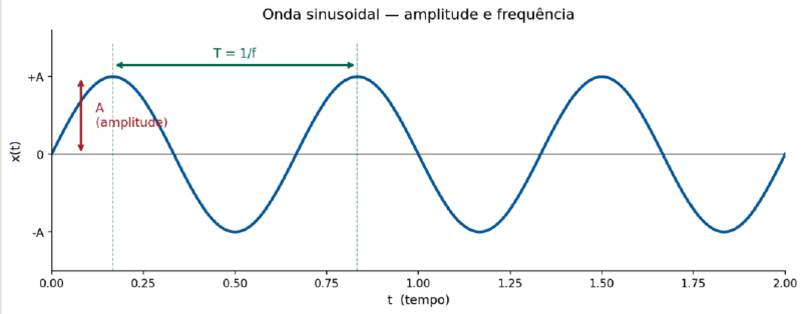
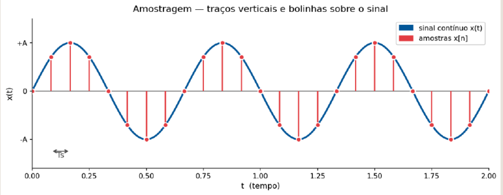
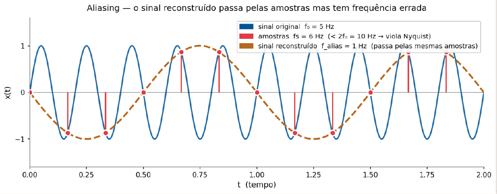
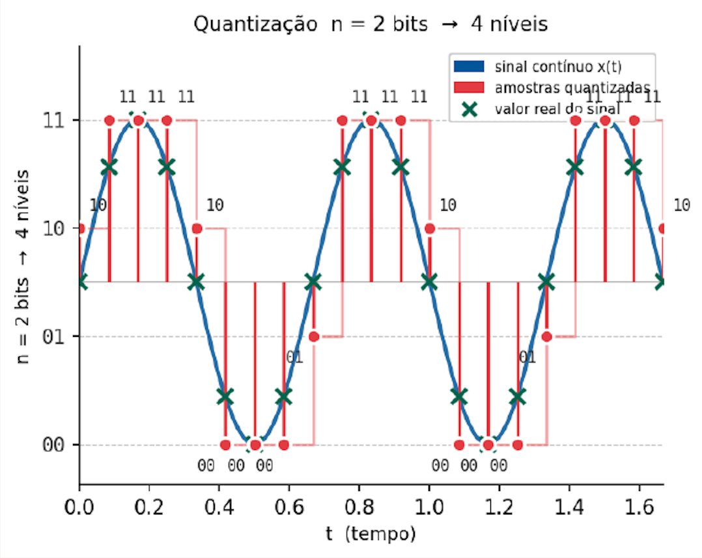
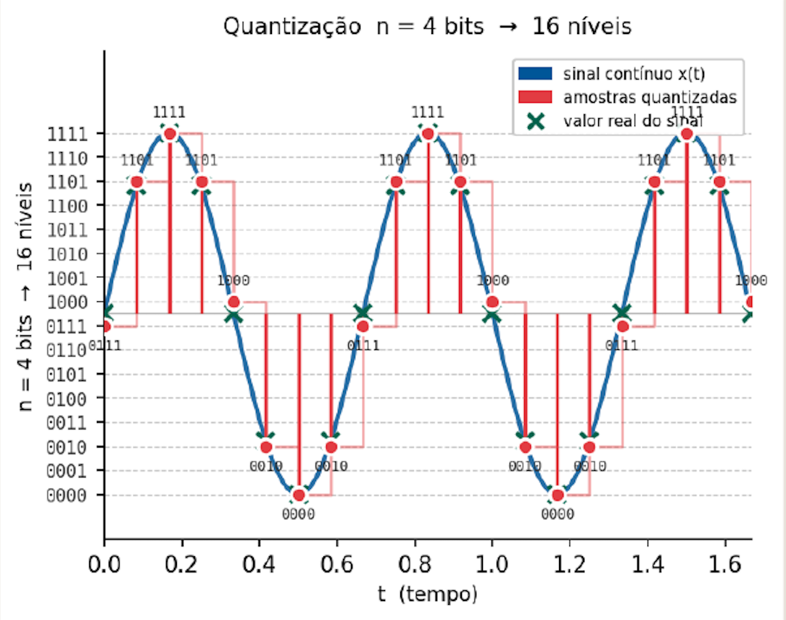
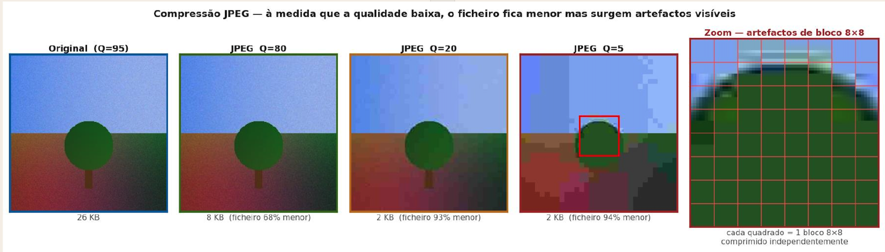

## Enquadramento {#sec-enquadramento}

No capítulo anterior estabeleceu-se que toda a informação digital
é representação numérica: texto, cor, imagem e áudio traduzem-se
em sequências de bits organizados segundo convenções de codificação.
Ficou, porém, por responder uma questão essencial: como é que os
sinais do mundo real — contínuos, analógicos, ricos em detalhe —
se convertem nessas sequências de números?

É precisamente esse processo — a **digitalização** — o objecto
deste capítulo. Analisa-se também a consequência imediata da
digitalização: os ficheiros resultantes são volumosos, e a sua
transmissão e armazenamento exigem **compressão**. No final,
apresentam-se os principais formatos de imagem e áudio utilizados
na web, com critérios práticos de escolha.

---

## Sinais no Mundo Real {#sec-sinais}

### Sinais contínuos e sinais discretos {#sec-sinais-tipos}

A maior parte dos fenómenos naturais que interessam à multimédia
— som, luz, temperatura, pressão — são **sinais contínuos**: variam
em todos os instantes do tempo e podem assumir infinitos valores
possíveis. Uma onda sonora, por exemplo, existe de forma ininterrupta
na natureza, com amplitude que varia suavemente a cada fracção
de segundo.

Os computadores, pelo contrário, trabalham com **sinais discretos**:
representações compostas por valores separados, num número finito
de níveis. Para armazenar, transmitir e processar um sinal natural
num computador, é necessário convertê-lo de contínuo para discreto.
Esse processo chama-se digitalização.

| | Sinal contínuo | Sinal discreto |
|:--|:--|:--|
| Variação | Contínua em todos os instantes | Valores separados |
| Amplitude | Infinitos valores possíveis | Número finito de níveis |
| Exemplo | Onda sonora analógica | Áudio digital amostrado |

---

## Digitalização {#sec-digitalizacao}

### O processo de digitalização {#sec-digitalizacao-processo}

Digitalizar significa converter um sinal contínuo num conjunto
de valores numéricos que o representam com suficiente fidelidade.
Este processo é o que permite armazenar música num ficheiro,
gravar vídeo numa câmara ou transmitir voz por uma chamada digital.

A digitalização decompõe-se em três etapas sequenciais:

$$\text{Sinal contínuo}
\xrightarrow{\text{Amostragem}}
\xrightarrow{\text{Quantização}}
\xrightarrow{\text{Codificação}}
\text{Sequência de bits}$$

Cada etapa introduz uma aproximação ao sinal original — a qualidade
final depende das escolhas feitas em cada uma delas.

---

## Amostragem {#sec-amostragem}

### O que é a amostragem {#sec-amostragem-def}

A **amostragem** consiste em medir o valor do sinal em intervalos
regulares de tempo. Em vez de registar o sinal de forma contínua
— o que seria impossível num sistema digital — recolhe-se uma
*amostra* a cada intervalo fixo. Quanto mais amostras por segundo,
mais fielmente o sinal original é representado.

{#fig-amostragem_1 fig-align="center" width="90%"}

{#fig-amostragem_2 fig-align="center" width="90%"}

### Frequência de amostragem {#sec-frequencia-amostragem}

O número de amostras recolhidas por segundo designa-se **frequência
de amostragem** e mede-se em hertz (Hz) — ou, mais correctamente,
em amostras por segundo. A relação é directa: frequência mais alta
significa maior fidelidade ao sinal original, mas também maior
volume de dados.

| Contexto | Frequência | Amostras/s |
|:---------|:----------:|----------:|
| Telefone | 8 kHz | 8 000 |
| Áudio CD | 44,1 kHz | 44 100 |
| Áudio HD | 96–192 kHz | 96 000–192 000 |

O padrão de 44,1 kHz do CD foi estabelecido com base no teorema
de Nyquist, como se explica na secção seguinte.

### Teorema de Nyquist {#sec-nyquist}

O teorema de Nyquist-Shannon é o fundamento teórico da amostragem
digital. Enuncia-se da seguinte forma:

> Para representar correctamente um sinal, a frequência de
> amostragem deve ser pelo menos o dobro da frequência máxima
> presente no sinal.

$$f_a \geq 2 \times f_{\text{máx}}$$

A título de exemplo: a voz humana contém frequências até
aproximadamente 4 kHz; para a digitalizar correctamente, é
necessário amostrar a pelo menos 8 kHz — daí o padrão telefónico.
O ouvido humano percebe frequências até cerca de 20 kHz; o padrão
CD de 44,1 kHz cobre esse intervalo com margem de segurança.

Quando a frequência de amostragem é inferior ao limiar de Nyquist,
ocorre **aliasing**: o sinal reconstruído tem uma frequência errada
— diferentes das do sinal original — porque as amostras são
insuficientes para distinguir os ciclos do sinal.

{#fig-nyquist_1 fig-align="center" width="85%"}

::: {.callout-important}
O aliasing é uma distorção **irreversível** — uma vez que o sinal
foi amostrado abaixo do limiar de Nyquist, a informação perdida
não pode ser recuperada.
:::

---

## Quantização {#sec-quantizacao}

### O que é a quantização {#sec-quantizacao-def}

Após a amostragem, cada valor medido é um número real — pode
assumir qualquer valor dentro de um intervalo contínuo. O sistema
digital, porém, só consegue armazenar valores inteiros num conjunto
finito de níveis. A **quantização** é o processo de mapear cada
valor amostrado para o nível discreto mais próximo dentro dessa
escala finita.

Intuitivamente: imagine uma régua com marcações apenas nos
centímetros inteiros. Qualquer medida (13,7 cm, 8,3 cm) tem de ser
arredondada para o valor marcado mais próximo (14 cm, 8 cm).
Quanto mais marcações a régua tiver, menor o erro de arredondamento.

O número de níveis disponíveis é determinado pela **profundidade
de bits**: com $n$ bits obtêm-se $2^n$ níveis distintos.

{#fig-quantizacao_1 fig-align="center" width="70%"}

{#fig-quantizacao_2 fig-align="center" width="70%"}

### Profundidade de bits {#sec-profundidade-bits}

| Profundidade | Níveis | Aplicação típica |
|:------------:|-------:|:-----------------|
| 8 bits  | 256        | Telefone, rádio AM |
| 16 bits | 65 536     | Padrão CD — qualidade elevada |
| 24 bits | 16 777 216 | Estúdio profissional |

O padrão CD combina amostragem a 44,1 kHz com profundidade de
16 bits — uma escolha que cobre a gama perceptível pelo ouvido
humano com qualidade suficiente para a grande maioria dos contextos.

---

## Compressão {#sec-compressao}

### A necessidade de compressão {#sec-necessidade-compressao}

Os ficheiros multimédia não comprimidos ocupam volumes de dados
consideráveis. Para dimensionar o problema, calculam-se dois
exemplos representativos:

**Imagem 1920×1080 px a 24 bits:**

| Passo | Operação | Resultado |
|:------|:---------|----------:|
| Píxeis totais | 1920 × 1080 | 2 073 600 px |
| Bits totais | 2 073 600 × 24 | 49 766 400 bits |
| Bytes | 49 766 400 ÷ 8 | 6 220 800 bytes |
| Megabytes | 6 220 800 ÷ 1 048 576 | **≈ 5,93 MB** |

**Áudio WAV estéreo — 44,1 kHz / 16 bits / 1 minuto:**

| Passo | Operação | Resultado |
|:------|:---------|----------:|
| Amostras por canal | 44 100 × 60 s | 2 646 000 |
| Amostras totais | 2 646 000 × 2 canais | 5 292 000 |
| Bits totais | 5 292 000 × 16 | 84 672 000 bits |
| Megabytes | 84 672 000 ÷ 8 ÷ 1 048 576 | **≈ 10,09 MB** |

Um filme de duas horas em qualidade HD não comprimida ocuparia
na ordem dos 200 GB — inviável para transmissão ou armazenamento
doméstico. Daí a necessidade de compressão.

### Compressão sem perdas {#sec-sem-perdas}

A **compressão sem perdas** (*lossless compression*) elimina
apenas a redundância presente nos dados — padrões repetidos,
sequências previsíveis, informação que pode ser reconstruída
matematicamente. Os dados originais são recuperáveis na íntegra
após descompressão.

Dois algoritmos clássicos ilustram os princípios fundamentais:

**Codificação de Huffman** — atribui códigos binários mais curtos
aos símbolos mais frequentes e códigos mais longos aos mais raros.
Para a sequência `BBBBBBBBBBAAAACCCDD`, o símbolo B (frequência 10)
recebe o código `0` (1 bit), enquanto D (frequência 2) recebe `110`
(3 bits) — poupança de 12,5% face ao código fixo.
 e RLE — Run-Length Encoding (direita). Ambos são algoritmos de compressão sem perdas."){#fig-huffman fig-align="center" width="90%"}

**RLE (Run-Length Encoding)** — substitui sequências de símbolos
repetidos pelo par (contagem, símbolo). A sequência de 14 caracteres
`AAABBBBBCCDDDDD` é codificada como `3A5B2C4D` — 8 caracteres,
poupança de 43%.

 e RLE — Run-Length Encoding (direita). Ambos são algoritmos de compressão sem perdas."){#fig-rle fig-align="center" width="90%"}

Outros algoritmos sem perdas amplamente utilizados incluem LZ77,
LZ78 e DEFLATE (este último é a base dos formatos ZIP e PNG).

**Quando usar compressão sem perdas:**
documentos de texto, gráficos com áreas de cor uniforme, imagens
com texto, logótipos, e qualquer situação em que a qualidade
máxima é obrigatória.

### Compressão com perdas {#sec-com-perdas}

A **compressão com perdas** (*lossy compression*) vai mais longe:
remove informação que os modelos da percepção humana consideram
pouco perceptível. O resultado é um ficheiro substancialmente
mais pequeno, mas a qualidade original não é recuperável.

Os algoritmos de compressão com perdas exploram limitações do
sistema perceptivo humano — o olho é menos sensível a variações
de alta frequência em regiões de baixo contraste, o ouvido é
menos sensível a sons fracos mascarados por sons fortes, etc.
Formatos como JPEG (imagem), MP3 e AAC (áudio) e H.264 (vídeo)
baseiam-se neste princípio.

{#fig-jpeg-qualidade fig-align="center" width="90%"}

**Limitações da compressão com perdas:**

- A qualidade original não é recuperável após compressão
- Artefactos tornam-se visíveis a taxas de compressão muito elevadas
- Compressões repetidas degradam progressivamente a qualidade
  (*generation loss*)

### O compromisso qualidade vs. tamanho {#sec-compromisso}

Não existe uma escolha universalmente correcta entre qualidade e
tamanho — depende do contexto de uso:

| Contexto | Prioridade | Escolha típica |
|:---------|:-----------|:--------------|
| Arquivo | Qualidade máxima | Sem perdas (PNG, WAV) |
| Web | Equilíbrio | JPEG médio, WebP |
| Streaming | Tamanho mínimo | Compressão elevada |
| Edição | Sem degradação | Sem perdas ou RAW |

---

## Formatos de Imagem {#sec-formatos-imagem}

A escolha do formato de imagem afecta directamente a qualidade
visual, o tamanho do ficheiro e a compatibilidade com browsers
e ferramentas. Apresentam-se os quatro formatos fundamentais
para a web.

### JPEG {#sec-jpeg}

O **JPEG** (*Joint Photographic Experts Group*) é o formato
dominante para fotografia digital. Utiliza compressão com perdas
baseada na transformada de cosseno discreta (DCT), que opera
em blocos de 8×8 píxeis.

- Compressão com perdas, controlada por um parâmetro de qualidade
- Excelente para fotografias e imagens com gradientes suaves
- Suporte universal em todos os browsers
- Não suporta transparência (canal alfa)
- Não adequado para imagens com texto ou bordas nítidas

**Usar quando:** fotografias, imagens realistas, imagens com
gradientes, quando o tamanho do ficheiro é prioritário.

### PNG {#sec-png}

O **PNG** (*Portable Network Graphics*) foi criado como alternativa
sem perdas ao GIF. Utiliza o algoritmo DEFLATE para compressão.

- Compressão sem perdas — qualidade original preservada
- Suporta transparência total (canal alfa de 8 bits)
- Ideal para gráficos, interface de utilizador e imagens com texto
- Ficheiros tipicamente maiores que JPEG para fotografias

**Usar quando:** logótipos, ícones, capturas de ecrã, imagens
com texto, elementos de interface, quando a transparência é necessária.

### SVG {#sec-svg}

O **SVG** (*Scalable Vector Graphics*) é fundamentalmente diferente
dos formatos anteriores: não armazena píxeis, mas sim descrições
matemáticas de formas, curvas e texto em formato XML.

- Formato vectorial — escala sem qualquer perda de qualidade
- Editável directamente com código ou editor de texto
- Tamanho muito reduzido para gráficos simples
- Suporta animações via CSS e JavaScript
- Não adequado para fotografias

**Usar quando:** ícones, logótipos, ilustrações para ecrã,
diagramas, animações, quando há múltiplas resoluções de ecrã.

### WebP {#sec-webp}

O **WebP** foi desenvolvido pela Google em 2010 como formato
moderno para a web, suportando tanto compressão com perdas
como sem perdas.

- Com ou sem perdas, conforme a configuração
- 20–34% mais pequeno que JPEG na mesma qualidade perceptível
- Suporta transparência (como PNG) e animação (como GIF)
- Suporte nos browsers modernos (Chrome, Firefox, Safari, Edge)

**Usar quando:** web moderna, aplicações web progressivas (PWA),
quando o desempenho de carregamento é crítico.

---

## Som Digital {#sec-som-digital}

### Representação do som digital {#sec-som-representacao}

O som digital é uma sequência de amostras numéricas que representam
a amplitude de uma onda sonora ao longo do tempo. Cada amostra é
um valor inteiro que indica a pressão sonora naquele instante.

O tamanho de um ficheiro áudio não comprimido calcula-se por:

$$\text{Tamanho} = f_a \times n_{\text{bits}} \times n_{\text{canais}} \times t_{\text{segundos}}$$

onde $f_a$ é a frequência de amostragem, $n_{\text{bits}}$ a
profundidade de bits, $n_{\text{canais}}$ o número de canais
(1 para mono, 2 para estéreo) e $t$ a duração em segundos.

### Formatos áudio {#sec-formatos-audio}

**WAV** — formato sem compressão (PCM puro). Preserva a qualidade
máxima e é o padrão para edição profissional. Ficheiros grandes.

**MP3** — compressão com perdas baseada em modelos psicoacústicos.
Muito compacto e amplamente suportado. Perde frequências altas
a taxas de compressão elevadas. Formato dominante durante décadas.

**AAC** (*Advanced Audio Coding*) — compressão com perdas de
geração posterior ao MP3. Melhor qualidade à mesma taxa de
transferência. Padrão adoptado pela Apple e pelo YouTube.

| Formato | Compressão | Qualidade | Tamanho | Uso típico |
|:--------|:----------:|:--------:|:-------:|:-----------|
| WAV     | Nenhuma    | Máxima   | Grande  | Edição, arquivo |
| MP3     | Com perdas | Boa      | Pequeno | Distribuição |
| AAC     | Com perdas | Muito boa| Pequeno | Streaming, móvel |

---

## Síntese {#sec-sintese}

- A **digitalização** converte sinais analógicos contínuos em
  sequências numéricas através de três etapas: amostragem,
  quantização e codificação.
- O **teorema de Nyquist** estabelece que a frequência de
  amostragem deve ser pelo menos o dobro da frequência máxima
  do sinal — abaixo deste limiar ocorre aliasing irreversível.
- A **profundidade de bits** determina o número de níveis de
  quantização: com $n$ bits obtêm-se $2^n$ níveis distintos.
- A **compressão sem perdas** elimina redundância preservando
  os dados originais na íntegra; a **compressão com perdas**
  remove informação pouco perceptível para obter ficheiros
  substancialmente mais pequenos.
- A escolha do **formato** correcto — JPEG, PNG, SVG, WebP,
  WAV, MP3, AAC — afecta qualidade, tamanho e desempenho,
  e depende do contexto de utilização.

---

## Exercícios {#sec-exercicios}

### Digitalização e amostragem

::: {.callout-caution}
#### Exercício 3.1 — Teorema de Nyquist
Determine a frequência de amostragem mínima para cada caso:

a) Sinal de áudio com frequência máxima de 8 kHz
b) Sinal de vídeo com frequência máxima de 6 MHz
c) Sinal de voz humana com frequência máxima de 4 kHz

*Verificação:* 16 kHz, 12 MHz e 8 kHz.
:::

::: {.callout-caution}
#### Exercício 3.2 — Tamanho de ficheiros áudio
Calcule o tamanho em megabytes de um ficheiro WAV estéreo
com as seguintes características:

a) 44,1 kHz / 16 bits / 3 minutos
b) 96 kHz / 24 bits / 1 minuto

*Verificação:* ≈ 30,3 MB e ≈ 34,3 MB.
:::

### Compressão e formatos

::: {.callout-caution}
#### Exercício 3.3 — Escolha de formato
Para cada situação, indique o formato de imagem mais adequado
e justifique a escolha:

a) Fotografia de produto para uma loja online
b) Logótipo de empresa para o cabeçalho de um site
c) Ícone de interface que deve funcionar em ecrãs de alta densidade
d) Captura de ecrã de documentação técnica com texto
:::

::: {.callout-caution}
#### Exercício 3.4 — Compressão sem perdas
Aplique o algoritmo RLE à seguinte sequência de 20 caracteres:

`AAAAABBBBBBBCCDDDDDD`

a) Qual é a representação RLE resultante?
b) Quantos caracteres ocupa a representação original?
c) Quantos caracteres ocupa a representação RLE?
d) Qual a taxa de compressão obtida?

*Verificação:* `5A7B2C6D` — 8 caracteres; taxa de compressão de 60%.
:::
